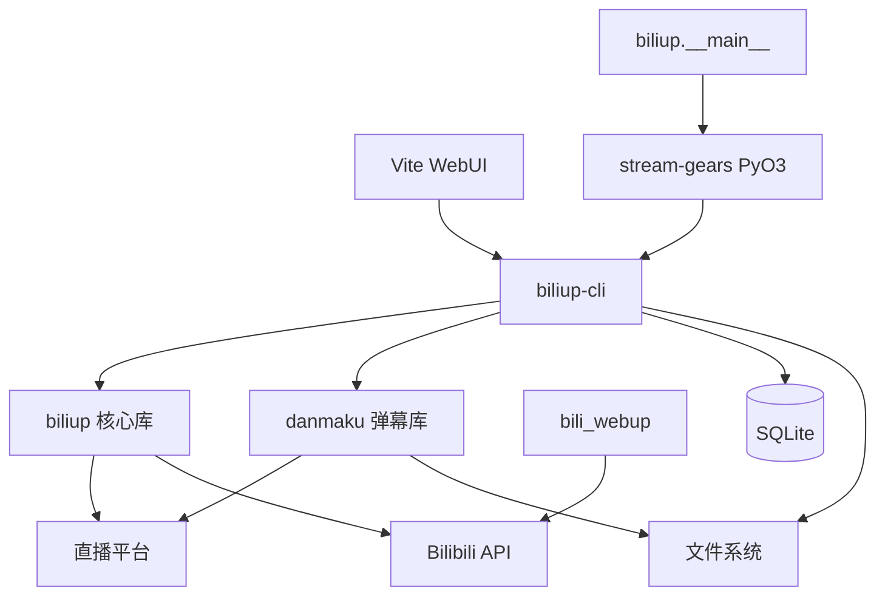

# 系统架构

biliup 采用 **Rust 后端 + Python 包 + Vite 前端** 的混合架构，各层职责清晰、可独立开发。

---

## 架构总览



各节点详细说明见下方「各层说明」章节。

---

## 各层说明

### 前端层（Vite + React）

| 项目 | 说明 |
|---|---|
| 技术栈 | React + TypeScript + [Semi Design](https://semi.design/)（字节跳动开源组件库） |
| 构建工具 | Vite |
| 运行端口 | 开发端口 `1420` / 生产 `19159`（由 Rust 后端托管） |
| 职责 | 提供 WebUI 管理界面，通过 REST API 与后端通信 |
| 源码位置 | `app/` 目录（主项目） |

开发启动：

```bash
npm i
npm run dev
# 访问 http://localhost:1420
```

### Rust 后端（`crates/`）

| Crate | 说明 |
|---|---|
| `biliup-cli` | 命令行入口 + Web API 服务，整合所有功能 |
| `biliup` | 核心库：直播解析、下载器调度、B站上传 |
| `danmaku` | 弹幕客户端（Rust 重构版），支持多平台弹幕录制，输出 XML |
| `stream-gears` | PyO3 扩展模块，Rust ↔ Python 桥梁，供 Python 包调用核心功能 |

Rust 后端的优势：
- 高性能：并发下载、上传不阻塞
- 内存安全：无 GC 压力，长时间运行稳定
- 跨平台：提供 Linux / macOS / Windows / Android 预编译二进制

### 下载器类型

源码中支持以下下载器类型：

| 下载器 | 说明 |
|---|---|
| `stream-gears`（默认） | Rust 原生下载器，无需 FFmpeg |
| `streamlink` | HLS 多线程下载，需 FFmpeg |
| `ffmpeg` | 通用下载器，需 FFmpeg |
| `sync-downloader` | 边录边传，实时上传 |
| `ytarchive` | 专为 YouTube Live 设计 |
| `ffmpeg`（外部分段） | FFmpeg 外部分段模式 |
| `ffmpeg`（内部分段） | FFmpeg 内部分段模式 |
| `yt-dlp` | 使用 yt-dlp 作为后端 |

### Python 包（`biliup/`）

| 模块 | 说明 |
|---|---|
| `biliup.__main__` | 最小入口，调用 `stream-gears` 启动主循环 |
| `bili_webup` | B站投稿库，可被外部 Python 项目 import 使用 |
| `bili_webup_sync` | 同步版投稿库 |

Python 包的存在意义：
- 兼容旧版脚本和自动化流程
- 供非 Rust 环境调用投稿功能
- 插件和钩子可用 Python 编写

### stream-gears PyO3 绑定

`stream_gears` 模块暴露了以下函数，可供 Python 脚本直接调用：

| 函数 | 说明 |
|---|---|
| `upload` | 上传视频到 B站 |
| `download` | 下载直播流 |
| `download_with_callback` | 带回调的下载 |
| `login_by_cookies` | Cookie 登录 |
| `send_sms` | 发送短信验证码 |
| `login_by_qrcode` | 二维码登录 |
| `get_qrcode` | 获取二维码 |
| `login_by_sms` | 短信登录 |
| `login_by_web_cookies` | Web Cookie 登录 |
| `login_by_web_qrcode` | Web 二维码登录 |
| `main_loop` | 主循环入口 |
| `config_bindings` | 配置绑定 |

### 数据层

| 存储 | 说明 |
|---|---|
| SQLite | 从 v0.4.33 起取代配置文件，存储主播列表、上传模板、任务状态、运行日志 |
| 文件系统 | 视频分段（`.flv` / `.mp4` / `.ts`）、弹幕 XML、封面图片、临时缓存 |

> ⚠️ v1.0.0 之前使用 `config.yaml` / `config.toml` 配置文件，升级后首次启动会自动迁移至数据库。

#### 数据库表结构

| 表名 | 说明 |
|---|---|
| `livestreamers` | 直播主播配置 |
| `uploadstreamers` | 上传模板 |
| `streamerinfo` | 录制记录 |
| `filelist` | 录制文件列表 |
| `configuration` | 全局配置和 Cookie 存储 |

---

## 请求流转

### 场景一：用户通过 WebUI 添加主播

```
用户操作（浏览器）
  → Vite 前端
  → POST /v1/streamers（REST API）
  → biliup-cli 处理
  → 写入 SQLite
  → 返回成功
  → 前端刷新主播列表
```

### 场景二：自动录制与上传

```
biliup-cli 定时检测直播间状态
  → 发现开播
  → 调用 biliup 核心库下载直播流
  → 写入文件系统（分段）
  → 下载完成后触发上传任务
  → 调用 biliup-rs / bili_webup 上传至 B站
  → 更新 SQLite 任务状态
  → WebUI 可查看进度
```

### 场景三：命令行直接上传

```
用户执行 biliup upload video.mp4
  → biliup-cli 解析参数
  → 读取 cookies.json（或提示登录）
  → 调用 Bilibili API 上传
  → 输出结果到终端
```

---

## Tauri 桌面应用（biliup-app）

biliup 提供基于 [Tauri](https://tauri.app/) 的桌面应用版本：

| 项目 | 说明 |
|---|---|
| 技术栈 | Tauri (Rust) + Vite (前端) |
| 后端机制 | 通过 sidecar 运行 `biliup.exe`，使用 GBK 编码解码输出 |
| 进程管理 | 退出时 `taskkill /F /T` 强制杀死进程树 |
| 前端端口 | `1420` |
| 源码位置 | [biliup-app-new](https://github.com/biliup/biliup-app-new) 独立仓库 |

---

## 跨平台支持

| 平台 | 架构 | 说明 |
|---|---|---|
| Windows | x86_64 | 预编译二进制 + Tauri 桌面应用 |
| Linux | x86_64 / aarch64 | 预编译二进制 |
| macOS | x86_64 / aarch64 | 预编译二进制 |
| Android (Termux) | aarch64 | 通过交叉编译 `aarch64-linux-android` 目标支持 |

---

## 技术栈版本要求

| 组件 | 最低版本 | 推荐版本 |
|---|---|---|
| Rust（编译 CLI） | 1.75 | stable |
| Node.js（前端开发） | 18 | 20 LTS |
| Python（Python 包） | 3.9 | 3.12 |
| npm | 9 | 10 |
| maturin（Python/Rust 桥接） | 1.0 | latest |

---

## 项目目录结构（主仓库）

```
biliup/
├── crates/              # Rust 核心库
│   ├── biliup/          # 核心：直播解析、下载、上传
│   ├── biliup-cli/      # 命令行与 Web API
│   ├── danmaku/         # 弹幕客户端
│   └── stream-gears/    # PyO3 Python 绑定
├── app/                 # Vite 前端（WebUI）
├── biliup/              # Python 包
├── docs/                # 文档源文件
├── public/              # 前端静态资源
├── Cargo.toml           # Rust 工作区配置
├── package.json         # Node.js 依赖
└── pyproject.toml       # Python 包配置
```

> 📦 WebUI 与桌面端（biliup-app）为[独立仓库](https://github.com/biliup/biliup-app-new)维护，不在主仓库内。

---

## 延伸阅读

- [开发指南（前端）](/guide/开发指南/frontend)
- [开发指南（Python）](/guide/开发指南/python)
- [开发指南（Rust CLI）](/guide/开发指南/rust-cli)
- [REST API 文档](/guide/api/rest-api)
